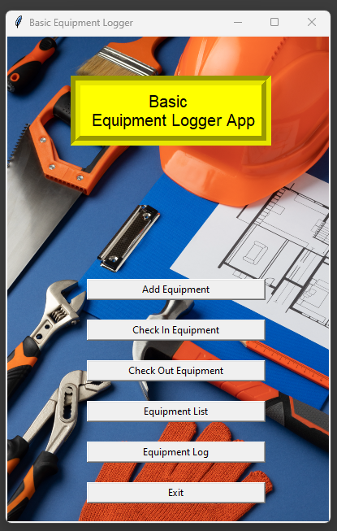

# About the Equipment Logger App

This is practically my first attempt at developing a complete python app and it was 
created as my final project for Stanford University "Code In Place 2024"

It is a basic equipment logger app inspired by the physical log book used at my workplace
to document employees usage of some equipment.

There are basic screens to
1. Enter equipment into a database
2. Check out the equipment
3. Check in the equipment
4. Basic report for equipment in the database
5. Basic equipment check out / in log report

I hope to continue developing this app even after the course to get it to 
possible production state

## Notes:

The repository includes a sqlite database that already have some records. If you would like
to start fresh, you can delete the *equipment.db* file

### Credits
+ Background image - www.freepik.com
+ I found this Youtube playlist - https://www.youtube.com/playlist?list=PLCC34OHNcOtoC6GglhF3ncJ5rLwQrLGnV -
by www.codemy.com on learning python very useful to fill out some of what was not part
of the course outline for Code In Place
+ Thanks to the awesome teachers @ https://codeinplace.stanford.edu/